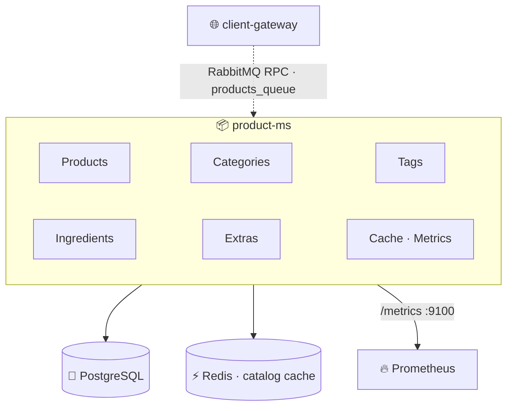
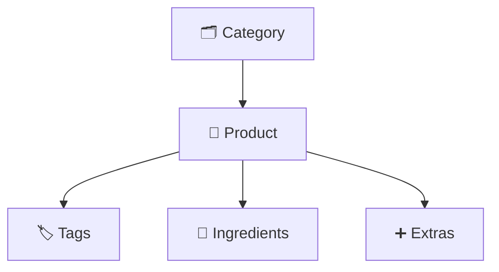
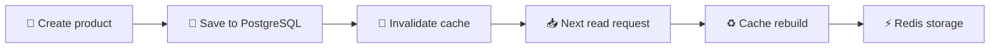

<h1 align="center">📦 Product Microservice · <code>product-ms</code></h1>

<p align="center">
  <b>NestJS microservice</b> managing the product catalog — products, categories, tags, ingredients,<br/>
  extras and their relationships. <i>The central catalog management system for all organizations.</i>
</p>

<p align="center">
  
  
  
  
  
</p>

<p align="center">
  
  
  
  
</p>

<br/>

## 🚀 Overview

`product-ms` manages products, categories, tags, ingredients, extras, product relationships, catalog caching and catalog metrics. It is fully organization-scoped and designed for multi-tenant restaurant and commerce platforms.

> [!IMPORTANT]
> The service communicates **exclusively through RabbitMQ** and serves as the central catalog for all organizations. Every order, POS, menu and storefront feature ultimately depends on data managed here.

> [!NOTE]
> This is the **only** application service with real, code-level Prometheus instrumentation — its `/metrics` HTTP server on port `9100` is its single actual HTTP listener.

<br/>

## 🏗️ Architecture



<br/>

## ✨ Features

Product / category / tag / ingredient / extra management · product-to-tag, product-to-ingredient and product-to-extra relationships · Redis caching · Prometheus metrics · soft deletes · multi-tenant architecture.

<br/>

## 🛠️ Tech Stack

| Category | Technology |
|---|---|
| Framework | NestJS 11 |
| Language | TypeScript 5 |
| Database | PostgreSQL |
| ORM | TypeORM |
| Messaging | RabbitMQ |
| Cache | Redis |
| Metrics | Prometheus |
| Validation | class-validator |
| Environment validation | Zod |
| Testing | Jest |

<br/>

## ⚙️ Getting Started

**Prerequisites:** Node.js 20+, PostgreSQL, RabbitMQ, Redis.

```bash
npm install
cp .env.example .env
npm run start:dev
```

<details>
<summary><b>📜 Available scripts</b></summary>

<br/>

```bash
npm run build
npm run start:dev       # start:dev / start:debug / start:prod
npm run test            # test / test:watch / test:cov
npm run test:e2e
```

</details>

<br/>

## 🌍 Environment Variables

| Variable | Required | Description |
|---|:---:|---|
| `NODE_ENV` | ✅ | Environment |
| `PORT` | ❌ | Logged only (not used for service communication) |
| `DB_HOST` | ✅ | PostgreSQL host |
| `DB_PORT` | ❌ | PostgreSQL port |
| `POSTGRES_USER` | ✅ | Database user |
| `POSTGRES_PASSWORD` | ✅ | Database password |
| `POSTGRES_DB` | ✅ | Database name |
| `RABBITMQ_URL` | ✅ | RabbitMQ connection |
| `RABBITMQ_QUEUE` | ✅ | Main queue |
| `REDIS_HOST` | ✅ | Redis host |
| `REDIS_PORT` | ❌ | Redis port |
| `REDIS_PASS` | ✅ | Redis password |
| `METRICS_PORT` | ❌ | Prometheus metrics server |

<br/>

## 📨 RabbitMQ Patterns

Each catalog entity exposes the same CRUD-style set (`create`, `find_all`/`findAll`, `find_one`/`findOne`, `update`, `delete`, `restore`).

<details>
<summary><b>🍔 Core catalog patterns (Products · Categories · Tags · Ingredients · Extras)</b></summary>

<br/>

| Group | Patterns |
|---|---|
| **Products** | `product.create` · `product.find_all` · `product.find_one` · `product.update` · `product.delete` · `product.restore` |
| **Categories** | `categories.create` · `categories.findAll` · `categories.findOne` · `categories.update` · `categories.delete` · `categories.restore` |
| **Tags** | `tag.create` · `tag.find_all` · `tag.find_one` · `tag.update` · `tag.delete` · `tag.restore` |
| **Ingredients** | `ingredient.create` · `ingredient.find_all` · `ingredient.find_one` · `ingredient.update` · `ingredient.delete` · `ingredient.restore` |
| **Extras** | `extra.create` · `extra.find_all` · `extra.find_one` · `extra.update` · `extra.delete` · `extra.restore` |

</details>

<details>
<summary><b>🔗 Relationship patterns (Product Tags · Ingredients · Extras)</b></summary>

<br/>

| Group | Patterns |
|---|---|
| **Product Tags** | `productTags.create` · `productTags.delete` |
| **Product Ingredients** | `productIngredients.create` · `productIngredients.delete` |
| **Product Extras** | `productExtras.create` · `productExtras.delete` |

</details>

<br/>

## 🍔 Product Catalog Structure

The catalog is built around products and their related entities:



<details>
<summary><b>🍕 Example: Pizza Margherita</b></summary>

<br/>

```text
Pizza Margherita
├── Category: Pizza
├── Tags: Vegetarian · Bestseller
├── Ingredients: Mozzarella · Tomato Sauce · Basil
└── Extras: Extra Cheese · Burrata
```

</details>

<br/>

## 🗄️ Database Entities

<details>
<summary><b>View all entities</b></summary>

<br/>

| Entity | Purpose | Main fields |
|---|---|---|
| **Product** | A catalog item | `organizationId`, `categoryId`, `name`, `description`, `price`, `stock`, `imageUrl`, `availability`, `isActive` |
| **Category** | A group of products (Pizzas, Burgers, Desserts…) | `organizationId`, `name` |
| **Tag** | Catalog labels (Vegetarian, Vegan, Spicy…) | `organizationId`, `categoryId`, `name` |
| **Ingredient** | Product ingredients (Tomato, Mozzarella…) | `organizationId`, `name` |
| **Extra** | Optional add-ons (Extra Cheese, Burrata, Bacon…) | `organizationId`, `name`, `price` |
| **ProductTag** | Product ↔ Tag relationship | — |
| **ProductIngredient** | Product ↔ Ingredient relationship | + `quantity` |
| **ProductExtra** | Product ↔ Extra relationship | — |

</details>

<br/>

## 🧠 Caching

The service implements Redis-based catalog caching.

| | |
|---|---|
| **Cache format** | `cache:<entity>:<organizationId>:<id>` |
| **Examples** | `cache:product:org-1:123` · `cache:category:org-1:456` · `cache:product:org-1:list` |

**Operations:** reads · writes · invalidation · versioning. **Benefits:** faster catalog queries, reduced database load, better scalability.



<br/>

## 📊 Metrics & Observability

Prometheus-compatible metrics are exposed at `GET /metrics` on default port `9100`.

<details>
<summary><b>Available metrics</b></summary>

<br/>

- **Cache metrics** — `products_ms_cache_hits_total`, `products_ms_cache_misses_total` (cache hit ratio / efficiency).
- **Database metrics** — `products_ms_db_query_duration_seconds` (query duration, DB performance, slow queries).
- **Node.js metrics** — provided automatically via `collectDefaultMetrics()`: CPU usage, memory usage, event loop lag, garbage collection, process statistics.

</details>

<br/>

## 🔗 External Dependencies

| Dependency | Usage |
|---|---|
| 🐘 **PostgreSQL** | Stores products, categories, tags, ingredients, extras, relationship tables |
| 🐇 **RabbitMQ** | Product CRUD, catalog communication, service integration (consumes from the configured queue) |
| ⚡ **Redis** | Catalog caching, invalidation, versioning |
| 🔥 **Prometheus** | Monitoring, metrics collection, performance analysis |

<br/>

## 🏢 Multi-Tenant Architecture

All catalog entities are organization-scoped, guaranteeing complete data isolation between tenants — each organization has its own products, categories, tags, ingredients and extras.

<br/>

## ⚠️ Development Notes / Limitations

> [!WARNING]
> Tracked openly and worth verifying before production.

- **Unimplemented relationship patterns:** these constants exist but have no handlers — `productTags.find_all` / `find_one` / `update`, `productExtras.find_all` / `find_one` / `update`, `productIngredients.find_all` / `find_one` / `update`.
- **Env example:** `.env.example` is missing `REDIS_PASS`, which the application requires during startup validation.
- **NATS dependency:** `nats` is included in `package.json` but has no active usage in the codebase.
- **Docker configuration:** the Dockerfile exposes `4001`, but the service communicates exclusively through RabbitMQ — the only real HTTP listener is the Prometheus metrics server.
- **Testing:** Jest is configured, but no active test files are currently present.

<br/>

## 📈 Service Scope

The central catalog service of the platform — product catalog, category, ingredient and extra management, product relationships, catalog caching and catalog observability. Every order, POS, menu and storefront feature ultimately depends on `product-ms`.

<p align="center">
  
</p>